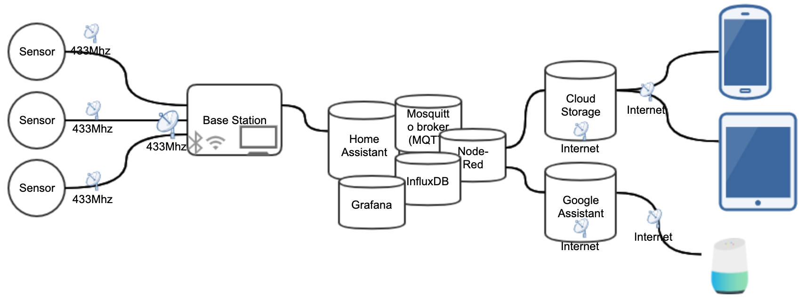

# Google Assistant based weather station
All documentation about this project is found here:
https://aconfluence.no/x/DQD1AQ

This project consist of several subprojects:
* Remote Sensors
* Base Station
* Cloud Storage
* Google Assistant
* Android & IOS App

More might come if I feel the need to.

I'm used to create user stories and create tasks from them but as far as I know, I can't do that here in Github.
I will therefor create issues and link them to GIT Projects, labels will also be used to filter issues.

This might change as I learn to use Github.
